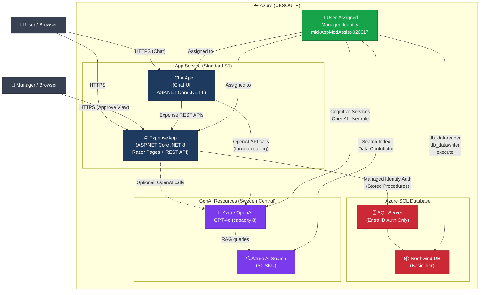

# Architecture Diagram

## Expense Management System - Azure Services



## Component Details

| Component | Azure Service | SKU | Region | Purpose |
|-----------|--------------|-----|--------|---------|
| ExpenseApp | App Service | Standard S1 | UK South | Main Razor Pages web app + REST API |
| ChatApp | App Service | Standard S1 | UK South | AI Chat UI (optional) |
| Managed Identity | User-Assigned MI | - | UK South | Passwordless auth for all Azure services |
| SQL Server | Azure SQL Server | - | UK South | Database server (Entra ID auth only) |
| Northwind DB | Azure SQL Database | Basic | UK South | Expense data storage |
| Azure OpenAI | Cognitive Services | S0 | Sweden Central | GPT-4o model for AI chat |
| AI Search | Azure Cognitive Search | Standard | UK South | RAG / search capabilities |

## Authentication Flow

```
App Service (with Managed Identity)
    → Uses Managed Identity Client ID
    → Azure AD issues token automatically
    → SQL Server validates token (no passwords)
    → Azure OpenAI validates token (no API keys)
    → AI Search validates token (no API keys)
```

## Deployment Commands

```bash
# Deploy without GenAI (app + database only):
bash deploy.sh

# Deploy with GenAI (full deployment including OpenAI + AI Search):
bash deploy-with-chat.sh
```

## Notes
- All resources use lowercase names (Azure requirement)
- Resource names are unique using `uniqueString(resourceGroup().id)`
- Azure OpenAI deployed to Sweden Central for GPT-4o quota availability
- GenAI resources are optional - the app works without them (shows dummy chat response)
- Navigate to `<app-url>/Index` to access the app (not the root URL)
